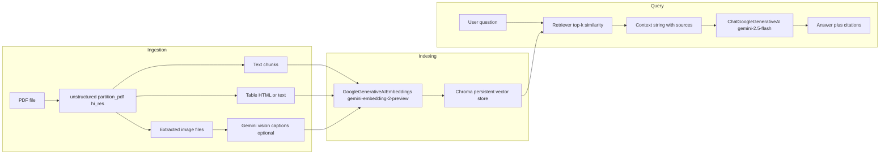
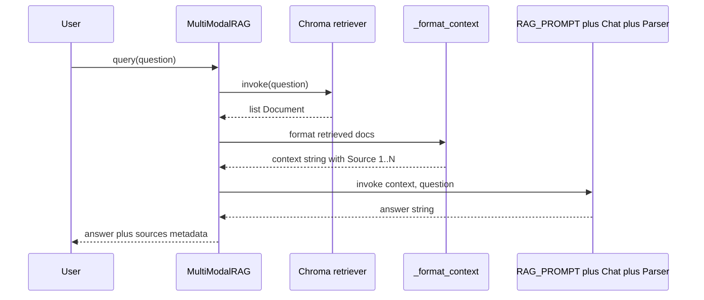

# Architecture

This document describes how the multi-modal RAG pipeline is structured, how data flows, and how components interact.

## High-level diagram

## Design choices

### Single vector collection

All chunk types (text, table, image-derived text) live in **one Chroma collection**. Retrieval is purely embedding similarity against the user query. This avoids maintaining separate stores or LangChain’s legacy `MultiVectorRetriever` (not aligned with LangChain 1.x layout in this project).

### How images participate in search

Image pixels are **not** embedded directly. Each extracted image is either:

1. **Captioned** with Gemini 2.5 Flash (vision): the caption text is embedded and stored, or  
2. **Placeholder text** only (`caption_images=False` / CLI `--no-image-captions`): a short deterministic description is embedded instead.

Option 2 avoids one `generate_content` call per image, which matters on **strict API quotas** (for example, free-tier daily limits on chat requests).

### Document “links”

The system does not host documents over HTTP. “Links” are **local file URIs** so users can open the PDF at a page or open an extracted image in a viewer:

| Metadata field | Meaning |
|----------------|---------|
| `doc_link` | `file:///…/document.pdf#page=N` |
| `image_link` | `file:///…/extracted.png` (when the file exists) |
| `source` | Absolute path to the source PDF |

### Table handling

`Table` elements from Unstructured prefer `metadata.text_as_html`, falling back to plain `text`. Tables are stored as **one chunk per table element** (no recursive splitting in the current implementation).

### Text handling

Non-table, non-image elements with text are split with `RecursiveCharacterTextSplitter` (default chunk size 1200, overlap 200).

## Sequence: query path

## Metadata schema (per `Document`)

Values are chosen to be **Chroma-friendly** (strings, ints; `-1` used when page is unknown).

| Key | Typical values |
|-----|----------------|
| `source` | Absolute path to PDF |
| `page` | 1-based page number, or `-1` |
| `content_type` | `"text"` \| `"table"` \| `"image"` |
| `doc_link` | PDF file URI with `#page=` fragment |
| `image_path` | Filesystem path to crop (images and sometimes tables) |
| `image_link` | File URI to crop, when file exists |

## Extension points

- **Models**: change names or dimensions in `multimodal_rag/config.py`; wiring in `models.py`.
- **Chunking**: `pdf_elements_to_documents` parameters `chunk_size` / `chunk_overlap`.
- **Retrieval breadth**: `MultiModalRAG` uses `search_kwargs={"k": 6}` on the retriever in `rag.py`.
- **Prompting**: `RAG_PROMPT` in `rag.py`.

## Dependencies (conceptual)

| Layer | Technology |
|-------|------------|
| PDF parsing | `unstructured` (hi-res strategy; layout + optional table/image extraction) |
| Embeddings | `langchain-google-genai` → Gemini Embedding API |
| Vector store | `langchain-chroma` → ChromaDB on disk |
| Chat | `langchain-google-genai` → Gemini generateContent |
| CLI / env | `python-dotenv`, `argparse` |

## Limitations

- **Quotas**: Gemini API limits apply separately to embedding calls, chat completion, and (if enabled) per-image captioning.
- **PDFs only** in the ingestion path as implemented; other formats would need new partitioners.
- **No deduplication** across repeated ingest runs: ingesting the same PDF twice adds duplicate vectors unless the collection is cleared or recreated.
