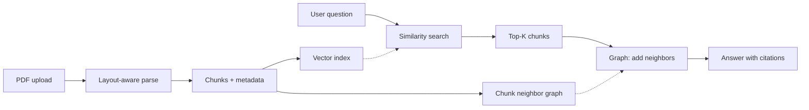
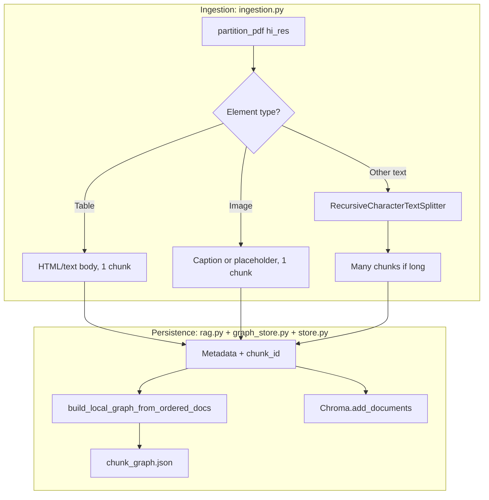
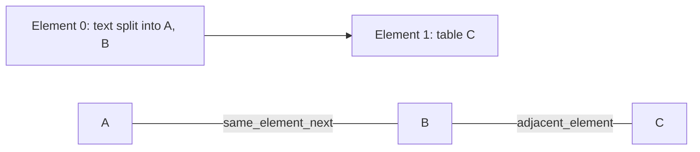
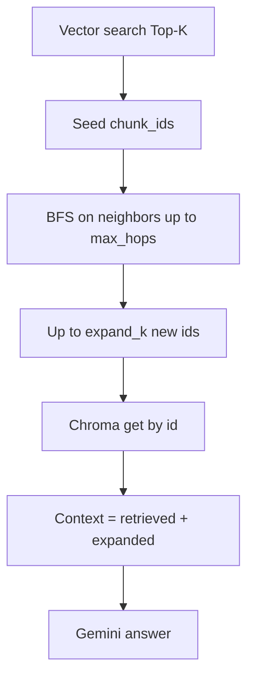
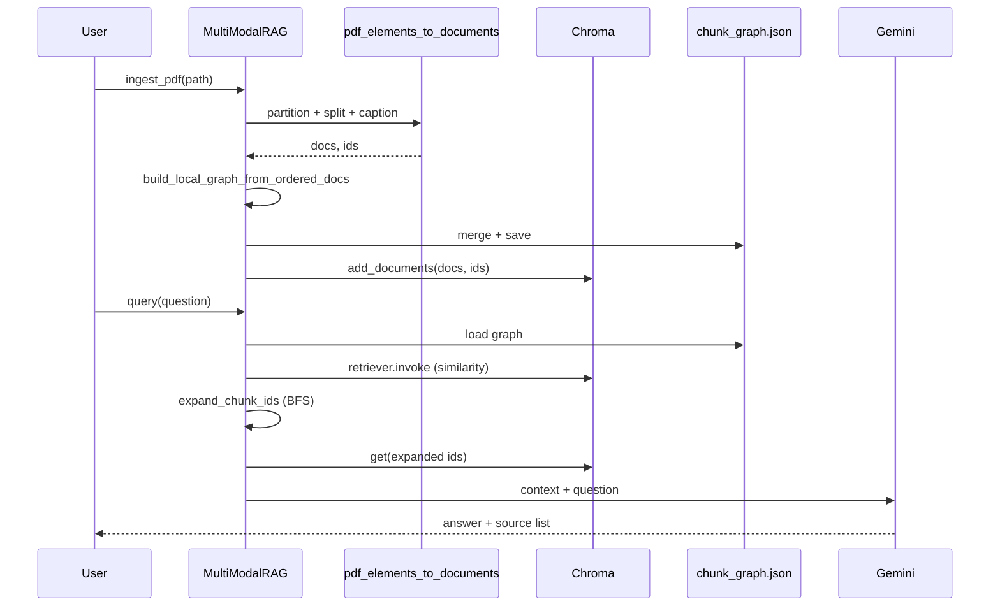

# Multimodal RAG — Document processing, retrieval, and chunk graph

This guide explains how PDFs become searchable chunks, how metadata supports citations and multimodal content, and how a **chunk adjacency graph** improves retrieval. It is written for **managers** (high-level outcomes) and **tech leads** (implementation detail).

---

## Part 1 — For managers: what the system does

### In one minute

1. **Ingest:** PDFs are read with layout-aware parsing so we keep **text**, **tables**, and **figures** as separate, ordered pieces.
2. **Enrich:** Figures can be **described in words** (vision model) so they are searchable like text.
3. **Index:** Every piece becomes a **chunk** stored in a **vector database** (semantic similarity search).
4. **Connect:** Chunks that were **next to each other** in the document are linked in a small **graph** so the system can pull in **neighboring context** when a search hits one chunk.
5. **Answer:** A question retrieves the most relevant chunks (plus graph neighbors), and a **chat model** answers using only that context, with **source links** back to the PDF page and optional image paths.

### Why the graph matters

Vector search alone can return an isolated sentence or table cell. **Graph expansion** adds **adjacent chunks** (same paragraph split across chunks, or the figure/table next to the paragraph that explains it), which often improves answer quality without changing the embedding model.

---

## Part 2 — Document processing pipeline (technical)

### High-level sequence

### Step 1 — PDF partitioning (`partition_pdf`)

The code uses **Unstructured** with:

| Setting | Role |
|--------|------|
| `strategy="hi_res"` | Higher-quality layout; better separation of blocks, tables, and images. |
| `extract_images_in_pdf=True` | Writes figure/table crops to disk for multimodal handling. |
| `extract_image_block_types=["Image", "Table"]` | Only those block types produce extracted image files. |
| `extract_image_block_to_payload=False` | Images go to files under `image_output_dir`, not inlined in memory. |

The output is an **ordered list of elements** — reading order in the PDF as determined by the library. That order is critical: it defines **document flow** and drives **graph edges** between consecutive chunks.

### Step 2 — How each element becomes chunks

Not all elements are split the same way.

#### Text-like elements (default branch)

- **Source:** `el.text` from Unstructured.
- **Splitting:** `RecursiveCharacterTextSplitter` from LangChain.
- **Defaults:** `chunk_size=1200`, `chunk_overlap=200` (characters). Tunable via `pdf_elements_to_documents(...)`.
- **Result:** One element can become **multiple** `Document` rows, each with its own `chunk_id`, shared `element_index`, and distinct `split_index` / `split_count`.

#### Tables (`Table`)

- **Body:** `metadata.text_as_html` if present, else `el.text`.
- **Splitting:** **None** — one table element → **one chunk** (entire table as one searchable unit).
- **Images:** If `metadata.image_path` exists, paths and `file://` links are attached for UI or debugging.

#### Images (`Image`)

- **Requirement:** Valid `metadata.image_path` on disk.
- **Embedding text:**  
  - If `caption_images=True` and a Gemini chat client is provided: a short **vision-generated description** (2–5 sentences) is produced and prefixed with `[IMAGE]`.  
  - Otherwise: a **placeholder** string referencing filename and page (no API call).
- **Splitting:** **One image → one chunk.**

Empty text elements are **skipped** (no chunk).

### Step 3 — Metadata on every chunk

Each LangChain `Document` carries structured metadata used for retrieval, graph edges, citations, and multimodal pointers.

| Field | Meaning |
|--------|--------|
| `chunk_id` | UUID string; primary id in Chroma and in the graph. |
| `element_index` | Index of the Unstructured element in the ordered partition list (0-based). |
| `split_index` | Which sub-chunk within that element (0 if only one). |
| `split_count` | Total sub-chunks for that element. |
| `source` | Absolute path to the PDF file. |
| `page` | Page number from element metadata, or `-1` if unknown. |
| `content_type` | `"text"` \| `"table"` \| `"image"`. |
| `doc_link` | `file://...` URI to the PDF, with `#page=N` when page ≥ 1 (`links.pdf_doc_link`). |
| `image_path` | Present for image chunks and some table chunks (extracted asset on disk). |
| `image_link` | `file://` URI to that asset when the file exists (`links.image_file_link`). |

**Tech lead note:** `chunk_id` is both the Chroma document id (passed as `ids=` in `add_documents`) and the vertex id in `chunk_graph.json`. That makes graph expansion a simple id lookup in Chroma.

---

## Part 3 — Chunk graph: structure and algorithms

### What is stored

`graph_store.ChunkGraph` is an **undirected** adjacency list:

- **`neighbors`:** `chunk_id → [neighbor_chunk_id, ...]`
- **`edge_types`:** Canonical key `min(a,b)|max(a,b)` → relationship label (for inspection; expansion treats the graph as undirected)

Edge type constants:

| Constant | Meaning |
|----------|--------|
| `same_element_next` | Consecutive chunks in the **same** `element_index` (e.g. second half of a long paragraph after text splitting). |
| `adjacent_element` | Consecutive chunks from **different** elements (e.g. paragraph then table). |

### How edges are built

`build_local_graph_from_ordered_docs(docs)` walks the **final list of documents in ingest order** and, for each pair `(docs[i], docs[i+1])`, adds an undirected edge between their `chunk_id`s. The relationship label is chosen by comparing `element_index` on the two metadata dicts.

### Persistence

On each `ingest_pdf`, the **local** graph for that batch is merged into the global graph and saved to:

`<persist_directory>/chunk_graph.json`

Format: JSON with `neighbors` and `edge_types`. Loading uses `ChunkGraph.load`; missing file → empty graph.

### Retrieval-time expansion

`expand_chunk_ids(seed_ids, graph, max_hops, expand_k)`:

1. **Seeds:** Chunk ids from the initial vector search (top-K).
2. **Traversal:** BFS up to **`max_hops`** (default in `MultiModalRAG`: 1).
3. **Budget:** Collect at most **`expand_k`** **new** ids not already in the seed set (order follows BFS discovery).
4. **Fetch:** Expanded ids are loaded from Chroma via `get(ids=...)` and appended **after** the original retrieved docs (order preserved for display and prompting).

**Manager takeaway:** Expansion is a controlled “include nearby paragraphs/figures” step, bounded by hop depth and count so latency and token use stay predictable.

---

## Part 4 — Retrieval and answering (`rag.py`)

### Components

| Piece | Role |
|-------|------|
| `get_vectorstore` | Chroma on disk with Gemini embeddings (`models.get_embeddings`). |
| `as_retriever(search_kwargs={"k": retrieve_k})` | Semantic search; default `retrieve_k=6`. |
| `ChunkGraph.load` | Fresh graph read each `query` (reflects latest ingest). |
| `RAG_PROMPT` + `get_chat()` | Gemini chat with system rules: answer from context only, cite `[Source N]`, mention image links when relevant. |

### Context formatting

`_format_context` builds one block per document:

- Header line: `content_type`, `page`, `doc_link`, `chunk_id`, optional `image_path` / `image_link`.
- Body: `source` path and `page_content`.

The model is instructed to cite **`[Source N]`** matching the block index.

### `MultiModalRAG` constructor knobs

| Parameter | Default | Effect |
|-----------|---------|--------|
| `retrieve_k` | 6 | Vector search breadth. |
| `graph_expand_k` | 8 | Max **additional** chunks from the graph. |
| `max_graph_hops` | 1 | BFS depth from each seed. |
| `use_graph_expand` | True | Toggle graph expansion off for A/B tests. |

---

## Part 5 — Module map (for engineers)

| Module | Responsibility |
|--------|----------------|
| `ingestion.py` | PDF → elements → LangChain `Document`s + parallel `ids`; captions for images. |
| `links.py` | `file://` URIs for PDF pages and extracted images. |
| `store.py` | Chroma factory with shared embedding model. |
| `graph_store.py` | Graph build/merge/save/load and BFS expansion. |
| `models.py` | Gemini embedding and chat wrappers; reads `config.py`. |
| `config.py` | Model names and embedding dimensionality. |
| `rag.py` | `MultiModalRAG`: ingest orchestration, retrieve, expand, prompt, return `answer` + `sources`. |
| `cli.py` | `ingest` / `query` entrypoints and env loading. |

---

## Part 6 — End-to-end diagram (ingest + query)

---

## Appendix — Viewing diagrams

The **Mermaid** blocks above render in GitHub, GitLab, many IDEs (Markdown preview), and documentation sites. If your viewer does not support Mermaid, paste the fenced `mermaid` source into [https://mermaid.live](https://mermaid.live) to export PNG/SVG for slides.

---

*Version aligned with package `__version__` in `__init__.py`.*
